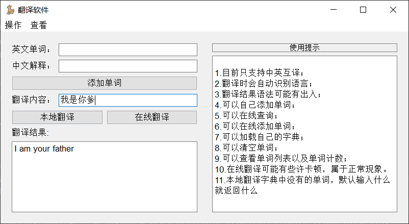

<h1 align="center">
  <p>
    Translation App
  <p>
</h1>
<div>
<h4 align="center">
    <p>
        <a href="/README.md">中文</a>|
        <b>English</b>
    <p>
<p>A PyQt5-based translation application for English and Chinese language translation.
</p>
</h4>
</div>


## Introduction

The translation application is a simple desktop application built using PyQt5, with only 500 lines of code to achieve most of the functions, not only provides local and online translation functions for English and Chinese texts, it allows users to translate words, sentences and paragraphs between English and Chinese , he would be a good tool.

## Features

- Translate English text to Chinese and vice versa.
- Add new words and their meanings to the local dictionary.
- Display translations using both local and online methods.
- Save and load the local dictionary to/from a JSON file.
- View the list of words and their meanings in the dictionary.
- Count the total number of words in the dictionary.
- Support for both local and online translation options.

## Installation

1. Clone this repository to your local machine.
2. Make sure you have Python 3.6 or later installed.
3. Install the required dependencies using the following command:

   ```bash
   pip install -r requirements.txt
   ```

## Usage

1. Run the application using the following command:

   ```bash
   python simple_translatepro.py
   ```

2. The application window will appear, allowing you to enter text for translation.

3. Use the different buttons to perform various actions, such as adding words to the dictionary, translating text, and more.

4. You can also access the menu bar to perform additional operations, such as saving and loading the dictionary, clearing the dictionary, and viewing dictionary contents.

## Screenshots




## License

This project is licensed under the MIT License - see the [LICENSE](LICENSE) file for details.
