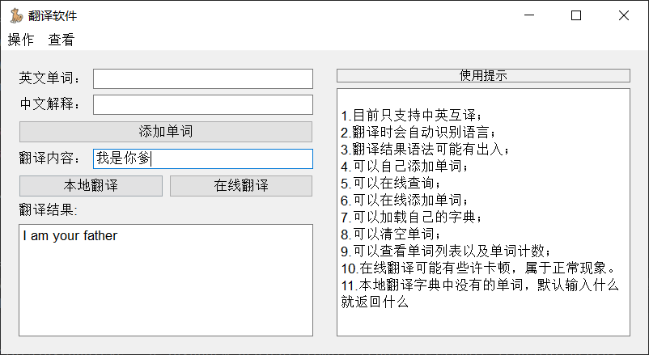

<h1 align="center">
  <p>
    Translation App
  <p>
</h1>
<div>
<h4 align="center">
    <p>
        <b>中文</b> |
        <a href="/README_EN.md">English</a>
    <p>
<p>一个基于 PyQt5 的英汉翻译应用程序。</p>
</h4>
</div>

## 介绍

翻译应用程序是一个使用 PyQt5 构建的简单桌面应用程序，为英汉文本提供本地和在线翻译功能。它允许用户在英语和汉语之间翻译单词、句子和段落。

## 特点

- 将英文文本翻译为中文，反之亦然。
- 将新单词及其含义添加到本地词典。
- 使用本地和在线方法显示翻译结果。
- 将本地词典保存到/从 JSON 文件加载。
- 查看词典中单词及其含义的列表。
- 统计词典中单词的总数。
- 支持本地和在线翻译选项。

## 安装

1. 将此仓库克隆到您的本地计算机。
2. 确保您已安装 Python 3.6 或更高版本。
3. 使用以下命令安装所需的依赖项：

   ```bash
   pip install PyQt5 googletrans
   ```

## 使用方法

1. 使用以下命令运行应用程序：

   ```bash
   python simple_translatepro.py
   ```

2. 应用程序窗口将出现，允许您输入要翻译的文本。

3. 使用不同的按钮执行各种操作，如将单词添加到词典、翻译文本等。

4. 您还可以访问菜单栏执行其他操作，如保存和加载词典、清空词典以及查看词典内容。

## 截屏



## 许可证

此项目在 MIT 许可下发布 - 有关详细信息，请参阅 [LICENSE](LICENSE) 文件。